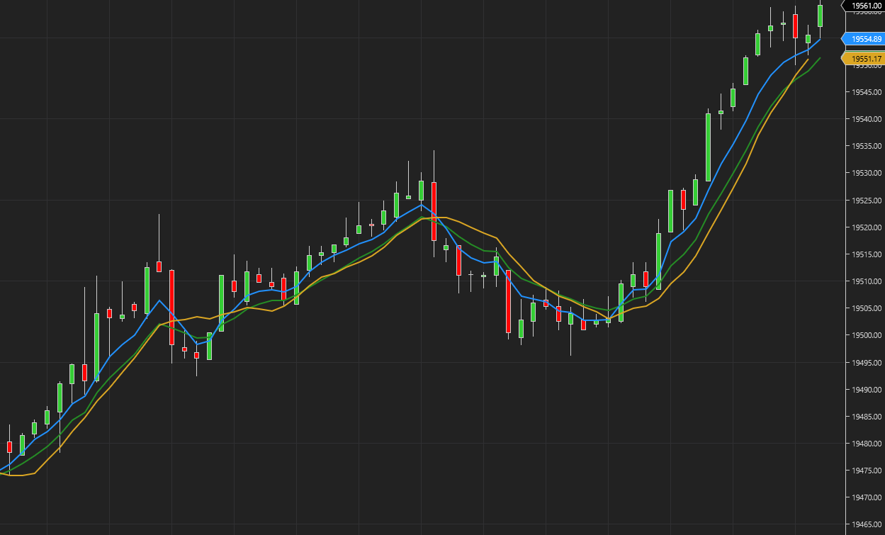

# Kalman Filter Line

Comparison:

Kalman Filter Line: Blue

EMA: Green

SMA: Gold

The Kalman Filter Line is a NinjaTrader indicator that applies a 1D Kalman filter to smooth price data, dynamically adjusting its responsiveness using autocorrelation of recent prices and ATR-based volatility scaling, offering a more adaptive alternative to traditional moving averages.

This forces the indicator to calculate OnBarClose, even if the user selects a different option. This is to prevent the filter to be overly sensitive to the current price.

**Base Q (Process Noise):** turn it up to make the line react faster to new price moves; turn it down to damp whipsaws.

**Base R (Measurement Noise):** turn it up to get a smoother, more stable line; turn it down to let raw price data influence the filter more strongly.

For usage, you can download the zip in the release page. You can import this zip file similar to importing a normal NinjaTrader Add-On. https://github.com/WaleeTheRobot/kalman-filter-line/releases

NinjaTrader Ecosystem: https://ninjatraderecosystem.com/user-app-share-download/kalman-filter-line-smarter-moving-average
